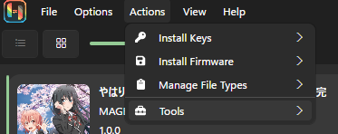
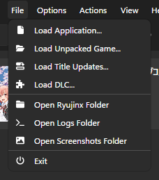
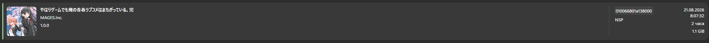

# set of OreGairu VN games by EleanorMay (Russia translation by community)
# пак визуальных новелл OreGairu , соб
!!! Все игры кроме третьей (Kan) вам нужно устанавливать вручную ибо в установке первых двух частей нет ничего сложного,
но третья игра идет в готовом для запуска виде (сделал все проще максимально насколько это возможно, Windows)
Для установки первых двух игр от вас требуется установить версию для вашей OS с гугл диска, ничего сложного.
в ближайшем будующем я лично займусь портом третьей игры на Windows, Linux, Android, так чтобы эмулятор для игры не понадобился.

## First game:

Google disk:
https://drive.google.com/drive/folders/1t1OK6VP_7aN_1W3fhUUMvZf_aVdP9D4N?usp=sharing

Windows & Linux:
https://drive.google.com/drive/folders/17JcG8xw5xn71yIpIR_8OpTtuQepYJWa2?usp=sharing

Android (.apk):
https://drive.google.com/drive/folders/1N5c0yYb5fXK0riNiIKYO0OWqfl447rXi?usp=sharing

Mac:
https://drive.google.com/drive/folders/1H0soZQXE6coPxPe0Y3gPlc0_LEuIRLEo?usp=sharing

Route guide:
https://docs.google.com/document/d/1t-CCy8jLD37YW43PXnYk_tUQPaf1sOz_/edit?usp=sharing&ouid=105696199102013754606&rtpof=true&sd=true

## Second game, Zoku:
Google disk:
https://drive.google.com/drive/folders/1Z1qTVNpEQ26PWGZv4oqfzAWkQr1jzqRY?usp=sharing

Windows & Linux:
https://drive.google.com/drive/folders/1lf8RiD6e6_I0tFDdEqTJh9KCGpmIrwnT?usp=sharing

Android (.apk):
https://drive.google.com/drive/folders/1_aDNXcsxIALCEO5GwRi_nB-OeJnzMwN3?usp=sharing

Mac:
https://drive.google.com/drive/folders/1djklRm9b0bxvSyrNyLp5F8NSND2b4go-?usp=sharing

Route guide:
https://docs.google.com/document/d/1eSj9yMpCqdYu5Zv_79sw-kvrj4JG2czh/edit?usp=sharing&ouid=105696199102013754606&rtpof=true&sd=true

## Third game, Kan:

Google disk:
https://drive.google.com/drive/folders/17emoFIZ4tISXZisqgSU3gyzykIWNWE5a?usp=sharing

(Additional - 1.01: https://drive.google.com/file/d/1H-RbIfn5TJX9UnRfa5mSdRuBw-EMxZhI/view?usp=sharing)

Nintendo Switch:
https://drive.google.com/drive/folders/1umtOQEk1v0hwYp-ws1WIPuwTkzjNNXmV?usp=sharing
Rom:
https://archive.org/details/oregairu-kan-switch
https://drive.google.com/drive/folders/1rJly8Q9vsHvO73gfGBfPWAkP-3zx5EAg?usp=sharing

Instructions to download on emulator:
https://docs.google.com/document/d/1Z0rHAp0IkKEERSTkY_j_Y7YOns7R2swLSk29BYSP6bs/edit?usp=sharing

Instructions to download on Switch:
https://docs.google.com/document/d/1Ggvm7-qvLt7kHxVe6RQBhLb_2f6kp2Z4zP3nhoCUUUE/edit?usp=sharing

Route guide:
https://docs.google.com/document/d/1fSRLpJb5az1gBajTIWvXPFEchniEWT66Z5YJ9QrqmHs/edit?usp=sharing

To run in ready emulator:
run Ryujinx.exe
run game in Ryujinx gui.

### Как запустить третью игру (Kan)?
Доступна только версия для Windows 10/11, на эмуляторе Ryujinx готовый к запуску.
Пошаговые действия для запуска эмулятора с игрой:
1. Установить последнее обновление на гитхабе.
2. Увидеть что в установленном архиве 2 папки и файл, распаковываем папку emulator целиком в удобное для запуска место.
3. Запускаем эмулятор. (Ryujinx.exe)
4. Устаналиваем прошивку и ключи для эмулятора отсюда: https://drive.google.com/file/d/1BPWKpuvzfaZsj8IlswMPKziWuLfqLoRn/view?usp=sharing
5. Переносим ключи и прошивку в любую удобную нам папку (предварительно распаковываем)
6. 
После этого устанавливаем ключи и прошивку в самом эмуляторе.
Install keys > Install keys (Folder) , откроется окно и мы выбираем путь к папке в которую положили ключи.
Install Firmware > Install Firmware (.XCI or .ZIP) , откроется окно и мы выбираем путь к .zip архиву который распаковали с ключами. 
7.  в этом разделе открываем Open Ryujinx Folder.
8. Переходим в корень папки Ryujinx (Roaming)
9. Удаляем папку Ryujinx переносим туда папку Ryujinx которую мы установили из репозитория.
10. Перезапускаем эмулятор от имени администратора.
11.  В списке появится третья игра.
12. Запускаем двумя кликами или пкм > Start

# Additional
Ryujinx emulator - https://git.ryujinx.app/projects/Ryubing/releases

Ryujinx keys - https://prodkeys.net/ryujinx-prod-keys-update/

Emulator keys + firmware - https://drive.google.com/file/d/1BPWKpuvzfaZsj8IlswMPKziWuLfqLoRn/view?usp=sharing

All games folder (Google disk) - https://drive.google.com/drive/folders/1LSt0n1opI7Va6HwNY1shcenr9JHm0wBx

# repo &  ports released by EleanorMay, vicont.

